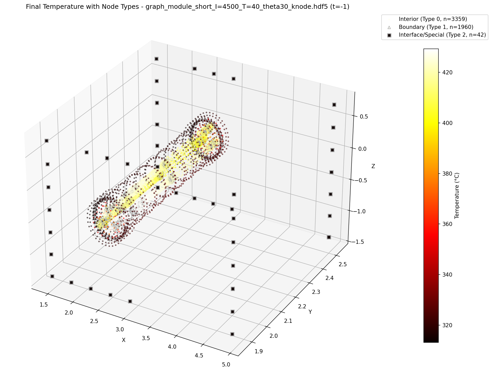
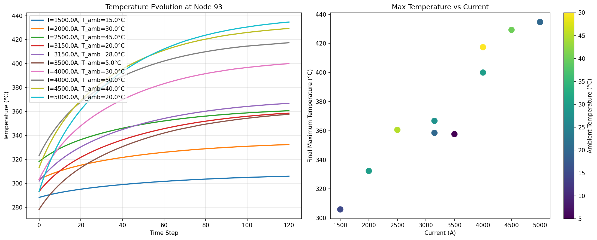
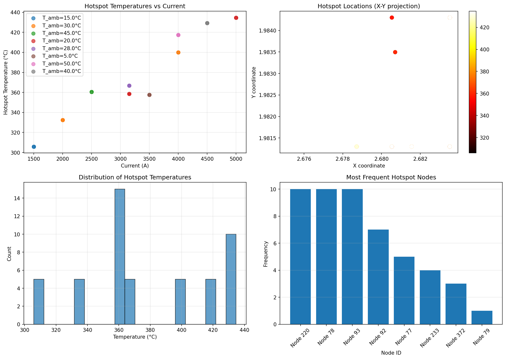

# Graph Heat Project

A machine learning project for analyzing and predicting heat distribution using graph neural networks on CFD (Computational Fluid Dynamics) data.

## Project Overview

This project implements a complete pipeline for processing CFD data, converting it to graph representations, and training graph neural networks for heat prediction tasks.

## Example Outputs

### Exploratory Data Analysis Results

The EDA pipeline generates comprehensive visualizations and reports. Here are some example outputs:

#### 1. Interactive HTML Report
<div align="center">
  
  <p><em>Interactive HTML report with comprehensive analysis findings</em></p>
</div>

The HTML report (`exploration_report.html`) provides:
- Complete dataset overview with interactive elements
- Individual simulation analysis cards
- Statistical summaries and correlations
- Modeling recommendations based on data characteristics
- [View Report](assets/exploration_report.html)

#### 2. Temperature Distribution with Node Types
<div align="center">
  
  <p><em>3D visualization showing temperature distribution with different node types (interior, boundary, interface)</em></p>
</div>

This visualization shows:
- **Interior nodes** (circles): Main mesh points with standard thermal properties
- **Boundary nodes** (triangles): Edge nodes with boundary conditions
- **Interface nodes** (squares): Special nodes at material interfaces
- Color mapping represents temperature magnitude (hot colors = higher temperatures)

#### 3. Multi-Simulation Comparison
<div align="center">
  
  <p><em>Comparison of temperature evolution across different simulation conditions</em></p>
</div>

Key insights from this comparison:
- Left plot: Temperature evolution over time for different current/ambient conditions
- Right plot: Correlation between input current and maximum temperature
- Color coding indicates ambient temperature effects
- Clear linear relationship with R² > 0.9

#### 4. Comprehensive Hotspot Analysis
<div align="center">
  
  <p><em>Statistical analysis of hotspot locations and temperatures across all simulations</em></p>
</div>

This comprehensive analysis reveals:
- **Top-left**: Current vs hotspot temperature relationship
- **Top-right**: Spatial distribution of hotspot locations
- **Bottom-left**: Temperature histogram showing hotspot distribution
- **Bottom-right**: Most frequent hotspot nodes for targeted monitoring

## Project Workflow

### Step 1: Exploratory Data Analysis (EDA)
**Main Script:** `generate_exploration_report.py`

This is the entry point for data exploration that orchestrates the entire EDA process:

#### Functionality:
- **Automated Pipeline**: Runs `explore_cfd_data.py` as a subprocess to perform comprehensive data analysis
- **Report Generation**: Creates an interactive HTML report with all exploration findings
- **Results Aggregation**: Combines analysis results from multiple sources into a unified report

#### Process Flow:
1. Executes `explore_cfd_data.py` via subprocess to analyze CFD simulation data
2. Loads analysis results from JSON files:
   - `outputs/eda/analysis_results.json` - Main analysis metrics
   - `outputs/eda/all_simulations_metadata.json` - Individual simulation details
3. Generates comprehensive HTML report with:
   - Dataset overview (number of simulations, mesh size, time steps)
   - Individual simulation analysis cards with visualizations
   - Spatial analysis summary (hotspot locations, temperature distributions)
   - Temporal analysis (steady-state times, temperature evolution patterns)
   - Node property statistics by type
   - Multi-simulation comparison and correlations
   - Modeling recommendations based on findings
   - Data quality assessment

#### Output Files:
- `outputs/eda/exploration_report.html` - Main HTML report
- `outputs/eda/analysis_results.json` - Structured analysis data
- `outputs/eda/all_simulations_metadata.json` - Per-simulation metadata
- `outputs/eda/sim_*/` - Individual simulation visualizations

#### Key Insights Generated:
- Temperature-current relationship sensitivity
- Hotspot identification and characterization
- Steady-state convergence analysis
- Feature importance for modeling
- Recommended prediction horizons

#### Usage:
```bash
# Run complete EDA pipeline and generate report
python generate_exploration_report.py

# The script will automatically:
# 1. Run explore_cfd_data.py
# 2. Process all simulation files
# 3. Generate visualizations
# 4. Create HTML report
```

#### Subprocess: `explore_cfd_data.py`

This script performs the detailed analysis of CFD simulation data:

##### Core Functions:

1. **Data Loading (`load_simulation_data`)**:
   - Loads HDF5 simulation files from `data/` directory
   - Extracts metadata from filenames (current and ambient temperature)
   - Handles both `.hdf5` and `.h5` file formats
   - Parses file patterns like `I=1500_T=15` for current and temperature values

2. **Data Structure Exploration (`explore_data_structure`)**:
   - Identifies and maps data arrays:
     - `node_pos`: 3D coordinates of mesh nodes (5361 nodes × 3 dimensions)
     - `temperature`: Temperature evolution (121 time steps × 5361 nodes)
     - `k`: Thermal conductivity values for each node
     - `node_types`: Node classification (interior, boundary, interface)
     - `edge_src/edge_dst`: Graph connectivity information
   - Handles 3D temperature arrays by squeezing unnecessary dimensions

3. **Spatial Analysis**:
   - **3D Temperature Visualization**: Creates 3D scatter plots with temperature color mapping
   - **Node Type Analysis**: Visualizes different node types with distinct markers:
     - Type 0: Interior nodes (circles)
     - Type 1: Boundary nodes (triangles)
     - Type 2: Interface/Special nodes (squares)
   - **2D Projections**: Generates XY, XZ, and YZ projections with node type overlays
   - **Hotspot Identification**: Finds nodes with highest temperatures and their coordinates

4. **Temporal Analysis**:
   - **Evolution Tracking**: Plots temperature vs time for selected nodes
   - **Steady-State Detection**: Determines convergence using rate-of-change threshold (0.01°C)
   - **Time Constant Estimation**: Calculates thermal response time (63.2% of final temperature)
   - **Pattern Recognition**: Identifies temperature rise patterns (exponential/linear)

5. **Node Property Analysis (`analyze_node_properties`)**:
   - Correlates temperature with:
     - Thermal conductivity (k values)
     - Node types (boundary conditions)
     - Spatial coordinates (X, Y, Z)
   - Generates correlation matrix and statistical summaries
   - Creates box plots for temperature distribution by node type

6. **Multi-Simulation Comparison (`compare_simulations`)**:
   - Compares temperature evolution across different operating conditions
   - Analyzes current-temperature relationships
   - Studies ambient temperature effects
   - Calculates sensitivity metrics (°C/A)
   - Performs linear regression with R² calculation

7. **Comprehensive Hotspot Analysis (`analyze_all_hotspots`)**:
   - Aggregates hotspot data across all simulations
   - Identifies most frequent hotspot locations
   - Analyzes hotspot temperature distributions
   - Creates frequency maps of critical regions

##### Visualization Outputs:
For each simulation, generates:
- `temperature_initial_3d.png`: Initial temperature distribution
- `temperature_final_3d.png`: Final steady-state temperature
- `temperature_final_3d_with_node_types.png`: Temperature with node type markers
- `temperature_by_node_type_separate.png`: Separate views for each node type
- `temperature_final_2d_*_with_node_types.png`: 2D projections (XY, XZ, YZ)
- `temperature_evolution.png`: Time series for representative nodes
- `node_property_analysis.png`: Property correlation analysis

Comparative visualizations:
- `simulation_comparison.png`: Cross-simulation temperature evolution
- `all_hotspots_analysis.png`: Comprehensive hotspot statistics

##### Data Files Generated:
- `outputs/eda/analysis_results.json`: Main analysis metrics and findings
- `outputs/eda/all_simulations_metadata.json`: Per-simulation metadata
- `outputs/eda/hotspots_summary.csv`: Detailed hotspot information
- `outputs/eda/sim_*/`: Individual simulation results folders

##### Key Metrics Extracted:
- **Spatial Metrics**:
  - Maximum/minimum temperatures and locations
  - Temperature gradients and distributions
  - Hotspot coordinates and intensities
  - Node type temperature statistics

- **Temporal Metrics**:
  - Steady-state convergence time
  - Time constants for thermal response
  - Temperature rise rates
  - Stability indicators

- **Correlation Metrics**:
  - Current sensitivity (°C/A)
  - Ambient temperature effects
  - R² values for predictive models
  - Feature importance rankings

##### Usage Notes:
- Automatically processes all HDF5 files in `data/` directory
- Handles varying mesh sizes and time steps
- Robust to missing data fields
- Creates comprehensive visualization suite
- Saves all results in JSON format for downstream processing

### Step 2: HDF5 Data Analysis
**Main Script:** `batch_analyze_hdf5.py`

This script orchestrates batch analysis of multiple HDF5 files in the dataset:

#### Functionality:
- Iterates through all HDF5 files in the data directory
- Calls `analyze_hdf5_metadata.py` for each file to extract detailed metadata
- Aggregates results across all files for comprehensive dataset understanding

#### Subprocess: `analyze_hdf5_metadata.py`

This script performs deep analysis of individual HDF5 files to extract comprehensive metadata:

##### Core Functions:

1. **Statistical Analysis (`compute_statistics`)**:
   - Calculates min, max, mean, standard deviation for numeric arrays
   - Detects and counts NaN values in floating-point data
   - Identifies outliers (values > 3 standard deviations from mean)
   - Handles non-numeric data gracefully

2. **Dataset Analysis (`analyze_dataset`)**:
   - Extracts basic metadata: shape, dtype, total size
   - Computes global statistics for entire dataset
   - For multi-dimensional arrays:
     - Analyzes each dimension/feature separately
     - Calculates percentiles (0, 25, 50, 75, 100)
   - Provides specialized analysis based on dataset type

3. **Specialized Dataset Handlers**:

   **Temperature Data**:
   - Analyzes temperature evolution from initial to final state
   - Tracks maximum and minimum temperatures reached
   - Calculates temperature rise over simulation
   - Estimates steady-state temperature
   - Computes maximum rate of temperature change
   - Time series statistics for convergence analysis

   **Node Position Data**:
   - Determines spatial bounds (X, Y, Z min/max)
   - Calculates mesh centroid location
   - Computes spatial extent in each dimension
   - Essential for understanding mesh geometry

   **Edge Data** (connectivity):
   - Counts unique nodes in graph
   - Determines node ID range
   - Calculates total number of edges
   - Validates graph structure integrity

   **Node Types**:
   - Categorizes and counts different node types:
     - Type 0: Interior nodes (standard mesh points)
     - Type 1: Boundary nodes (with boundary conditions)
     - Type 2: Interface/special material nodes
   - Calculates percentage distribution
   - Critical for understanding boundary conditions

##### Output Metadata Structure:

For each dataset in the HDF5 file, generates:
```json
{
  "dataset_name": {
    "shape": [dimensions],
    "dtype": "data_type",
    "size": total_elements,
    "global_stats": {
      "min": value,
      "max": value,
      "mean": value,
      "std": value,
      "num_nan": count,
      "num_outliers": count
    },
    "global_percentiles": {
      "p0": min_value,
      "p25": first_quartile,
      "p50": median,
      "p75": third_quartile,
      "p100": max_value
    },
    "features": {
      "dim_0": {statistics},
      "dim_1": {statistics},
      ...
    }
  }
}
```

##### Usage:

**Command Line Interface**:
```bash
# Analyze a single HDF5 file
python analyze_hdf5_metadata.py data/simulation.hdf5

# Specify output location
python analyze_hdf5_metadata.py data/simulation.hdf5 -o outputs/metadata.json

# The script will output:
# 1. Console summary of all datasets
# 2. Detailed statistics for each dataset
# 3. JSON file with complete metadata
```

**Programmatic Usage** (called by batch_analyze_hdf5.py):
```python
from analyze_hdf5_metadata import analyze_hdf5_file, save_metadata

# Analyze file
metadata = analyze_hdf5_file('data/simulation.hdf5')

# Save results
save_metadata(metadata, 'outputs/metadata.json')
```

##### Key Insights Provided:

1. **Data Quality Metrics**:
   - NaN detection for data validation
   - Outlier identification for anomaly detection
   - Statistical distribution for normalization planning

2. **Spatial Information**:
   - Mesh dimensions and boundaries
   - Node distribution and connectivity
   - Essential for graph construction

3. **Temporal Dynamics**:
   - Temperature evolution characteristics
   - Convergence behavior
   - Time-series patterns for model design

4. **Graph Structure**:
   - Node count and types
   - Edge connectivity statistics
   - Boundary condition distribution

##### Example Output:
```
Analyzing HDF5 file: data/I=1500_T=25.hdf5
File size: 124.35 MB

Found 6 datasets:
  - node_pos
  - temperature
  - k
  - node_types
  - edge_src
  - edge_dst

Analyzing dataset: temperature
  Shape: (121, 5361, 1), dtype: float32
  Global statistics (entire dataset in this file):
    Min: 25.000000, Max: 85.234567
    Mean: 45.678901, Std: 12.345678
    NaN count: 0, Outliers: 42

Analyzing dataset: node_types
  Node type distribution:
    Type 0 (interior node): 4829 nodes (90.08%)
    Type 1 (boundary node): 456 nodes (8.51%)
    Type 2 (interface/special material node): 76 nodes (1.42%)
```

##### Integration with Pipeline:

The metadata generated by this script is used by:
- `preprocess_gis_to_pyg.py`: To understand data structure for graph conversion
- `normalizer.py`: To determine normalization parameters
- `model.py`: To configure input/output dimensions
- Diagnostic scripts: To validate data integrity

### Step 3: Data Preprocessing
**Main Script:** `preprocess_gis_to_pyg.py`

This script converts raw HDF5 data to PyTorch Geometric format and prepares train/validation/test splits:

#### Functionality:
- Converts CFD mesh data to graph representations
- Transforms spatial data into PyG-compatible format
- Calls `train_val_test_split.py` to generate data splits
- Creates graph structures with node features and edge indices

#### Subprocess: `train_val_test_split.py`

This script generates a carefully designed train/validation/test split strategy for the dataset:

##### Split Strategy:

1. **Sample-Level Split** (Coarse-grained):
   - Total samples: 10 (S000 through S009)
   - **Training samples**: 8 samples (80%)
   - **Test samples**: 2 samples (20%)
   - Random selection with fixed seed for reproducibility
   - Ensures complete isolation of test data at the simulation level

2. **Timestep-Level Split** (Fine-grained for training samples):
   - Total timesteps per sample: 120 (after dropping initial timestep)
   - **Training timesteps**: 108 timesteps (90%)
   - **Validation timesteps**: 12 timesteps (10%)
   - Random selection ensures temporal diversity in validation
   - No overlap between training and validation timesteps

##### Key Features:

1. **Hierarchical Splitting**:
   ```
   Dataset (10 samples × 120 timesteps)
   ├── Train Set (8 samples)
   │   ├── Train Timesteps (108 per sample)
   │   └── Val Timesteps (12 per sample)
   └── Test Set (2 samples)
       └── All Timesteps (120 per sample)
   ```

2. **Reproducibility**:
   - Fixed random seed (default: 42)
   - Deterministic sample and timestep selection
   - Consistent splits across different runs

3. **Data Isolation**:
   - Test samples never seen during training
   - Validation timesteps provide temporal generalization check
   - Prevents data leakage between splits

##### Output Format:

Generates `processed_data/train_val_test_split.json`:
```json
{
  "protocol": "8_train_2_test_random_val_10pct",
  "seed": 42,
  "train_ids": ["S000", "S001", "S002", "S003", "S004", "S005", "S006", "S007"],
  "test_ids": ["S008", "S009"],
  "val_time_idx": [3, 15, 27, 39, 48, 56, 67, 78, 89, 95, 103, 115],
  "train_time_idx": [0, 1, 2, 4, 5, 6, ..., 117, 118, 119]
}
```

##### Usage:

**Standalone Execution**:
```bash
# Generate default split
python train_val_test_split.py

# Output:
# Split saved to: processed_data/train_val_test_split.json
# 
# TRAIN/VAL/TEST SPLIT SUMMARY
# ============================================================
# Protocol: 8_train_2_test_random_val_10pct
# Random seed: 42
# 
# Sample-level split:
#   Train samples: 8 - ['S000', 'S001', 'S002', ...]
#   Test samples: 2 - ['S008', 'S009']
# 
# Timestep-level split (for train samples):
#   Train timesteps: 108 indices
#   Val timesteps: 12 indices
```

**Programmatic Usage** (called by preprocess_gis_to_pyg.py):
```python
from train_val_test_split import generate_train_val_test_split

# Generate split with custom parameters
split = generate_train_val_test_split(
    num_samples=10,
    num_train=8,
    num_test=2,
    num_timesteps=120,
    val_percentage=0.1,
    seed=42
)
```

##### Split Statistics:

| Split Type | Samples | Timesteps | Total Data Points | Percentage |
|------------|---------|-----------|-------------------|------------|
| Training   | 8       | 108 each  | 864 snapshots     | 72%        |
| Validation | 8       | 12 each   | 96 snapshots      | 8%         |
| Test       | 2       | 120 each  | 240 snapshots     | 20%        |
| **Total**  | **10**  | **120**   | **1200 snapshots**| **100%**   |

##### Validation Strategy:

The split design enables multiple validation approaches:

1. **Temporal Validation**: 
   - Random timesteps from training simulations
   - Tests model's ability to predict unseen time points
   - Useful for interpolation tasks

2. **Simulation Validation**:
   - Entirely unseen simulations in test set
   - Tests generalization to new operating conditions
   - Critical for extrapolation capabilities

3. **Cross-Validation Ready**:
   - Can easily modify seed for different splits
   - Supports k-fold validation at sample level
   - Enables robust performance estimation

##### Integration with Pipeline:

The split file is used by:
- `normalizer.py`: Computes statistics only on training data
- `train.py`: Loads appropriate data subsets for training
- `test.py`: Evaluates on completely unseen test simulations
- Data loaders: Ensure proper data isolation during training

##### Best Practices:

1. **Fixed Seed**: Always use the same seed for reproducible research
2. **No Data Leakage**: Test samples are never used for normalization
3. **Balanced Validation**: Random timestep selection ensures temporal diversity
4. **Scalable Design**: Easy to adjust split ratios for different dataset sizes

### Step 4: Data Normalization
**Script:** `normalizer.py`
- Normalizes the dataset based on training set statistics
- Ensures consistent scaling across all data splits
- Saves normalization parameters for inference

### Step 5: Model Training
**Core Components:**
- `model.py`: Contains the graph neural network architecture
- `sampler.py`: Implements sampling strategies for batch creation
- `train.py`: Main training script that:
  - Loads the model from `model.py`
  - Uses sampling strategies from `sampler.py`
  - Trains the model with specified hyperparameters

**Shell Scripts for Training:**
- `train_basic.sh`: Basic training configuration
- `train_full.sh`: Full training with all features enabled
- `train_distributed.sh`: Distributed training across multiple GPUs (if available)

### Step 6: Model Testing
**Script:** `test.py`
- Evaluates the best trained model on the test dataset
- Generates performance metrics and visualizations

**Shell Scripts for Testing:**
- `test_best.sh`: Tests the best checkpoint
- `test_all.sh`: Tests all saved checkpoints
- `test_visualize.sh`: Tests with visualization outputs

### Step 7: Diagnostics
**Diagnostic Scripts:**
- `diagnose_data.py`: Identifies and reports data quality issues
- `diagnose_test_issue.py`: Troubleshoots testing problems

**Shell Scripts for Diagnostics:**
- `diagnose_pipeline.sh`: Runs full pipeline diagnostics
- `diagnose_memory.sh`: Checks memory usage and optimization
- `diagnose_performance.sh`: Analyzes model performance bottlenecks

## Installation

```bash
# Clone the repository
git clone <repository-url>
cd graph_heat

# Install dependencies
pip install -r requirements.txt
```

## Quick Start

### Running the Complete Pipeline

```bash
# 1. Explore the data
python generate_exploration_report.py

# 2. Analyze HDF5 files
python batch_analyze_hdf5.py

# 3. Preprocess and split data
python preprocess_gis_to_pyg.py

# 4. Normalize data
python normalizer.py

# 5. Train the model
bash train_basic.sh  # or train_full.sh for full training

# 6. Test the model
bash test_best.sh

# 7. Run diagnostics if needed
bash diagnose_pipeline.sh
```

## Shell Script Usage

### Training Scripts

- **`train_basic.sh`**: Quick training with default parameters
  ```bash
  bash train_basic.sh
  ```

- **`train_full.sh`**: Complete training with optimized hyperparameters
  ```bash
  bash train_full.sh
  ```

- **`train_distributed.sh`**: Multi-GPU distributed training
  ```bash
  bash train_distributed.sh
  ```

### Testing Scripts

- **`test_best.sh`**: Evaluate the best model checkpoint
  ```bash
  bash test_best.sh
  ```

- **`test_all.sh`**: Evaluate all saved checkpoints
  ```bash
  bash test_all.sh
  ```

- **`test_visualize.sh`**: Generate visualizations during testing
  ```bash
  bash test_visualize.sh
  ```

### Diagnostic Scripts

- **`diagnose_pipeline.sh`**: Check entire pipeline health
  ```bash
  bash diagnose_pipeline.sh
  ```

- **`diagnose_memory.sh`**: Analyze memory usage
  ```bash
  bash diagnose_memory.sh
  ```

- **`diagnose_performance.sh`**: Profile performance metrics
  ```bash
  bash diagnose_performance.sh
  ```

## Directory Structure

```
graph_heat/
├── data/                   # Raw and processed data
│   ├── raw/               # Original CFD/GIS data
│   ├── processed/         # PyG formatted data
│   └── splits/            # Train/val/test splits
├── models/                 # Saved model checkpoints
├── logs/                   # Training and testing logs
├── reports/                # EDA and analysis reports
├── scripts/                # Shell scripts
└── src/                    # Python source code
```

## Configuration

Configuration parameters can be modified in:
- `config.yaml`: Main configuration file
- Individual shell scripts for specific run configurations

## Requirements

- Python 3.10+
- PyTorch 1.9+
- PyTorch Geometric
- NumPy
- Pandas
- H5py
- Additional dependencies in `requirements.txt`

## License

[Specify your license here]

## Contact

[Your contact information]
