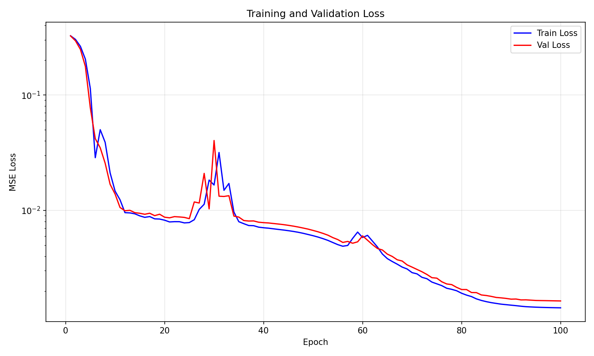

# Graph Heat Project

A machine learning project for analyzing and predicting heat distribution using graph neural networks on CFD (Computational Fluid Dynamics) data.

## Project Overview

This project implements a complete pipeline for processing CFD data, converting it to graph representations, and training graph neural networks for heat prediction tasks.

## Example Outputs

### Exploratory Data Analysis Results

The EDA pipeline generates comprehensive visualizations and reports. Here are some example outputs:

#### 1. Interactive HTML Report
<div align="center">
  
  <p><em>Interactive HTML report with comprehensive analysis findings</em></p>
</div>

The HTML report (`exploration_report.html`) provides:
- Complete dataset overview with interactive elements
- Individual simulation analysis cards
- Statistical summaries and correlations
- Modeling recommendations based on data characteristics
- [View Report](assets/exploration_report.html)

#### 2. Temperature Distribution with Node Types
<div align="center">
  
  <p><em>3D visualization showing temperature distribution with different node types (interior, boundary, interface)</em></p>
</div>

This visualization shows:
- **Interior nodes** (circles): Main mesh points with standard thermal properties
- **Boundary nodes** (triangles): Edge nodes with boundary conditions
- **Interface nodes** (squares): Special nodes at material interfaces
- Color mapping represents temperature magnitude (hot colors = higher temperatures)

#### 3. Multi-Simulation Comparison
<div align="center">
  
  <p><em>Comparison of temperature evolution across different simulation conditions</em></p>
</div>

Key insights from this comparison:
- Left plot: Temperature evolution over time for different current/ambient conditions
- Right plot: Correlation between input current and maximum temperature
- Color coding indicates ambient temperature effects
- Clear linear relationship with R² > 0.9

#### 4. Comprehensive Hotspot Analysis
<div align="center">
  
  <p><em>Statistical analysis of hotspot locations and temperatures across all simulations</em></p>
</div>

This comprehensive analysis reveals:
- **Top-left**: Current vs hotspot temperature relationship
- **Top-right**: Spatial distribution of hotspot locations
- **Bottom-left**: Temperature histogram showing hotspot distribution
- **Bottom-right**: Most frequent hotspot nodes for targeted monitoring

### Training Results

#### 5. Training Loss Convergence
<div align="center">
  
  <p><em>Training and validation loss convergence during model training</em></p>
</div>

This loss curve demonstrates:
- **Training Loss** (blue): Steady decrease indicating model learning
- **Validation Loss** (orange): Follows training loss, showing good generalization
- **No Overfitting**: Validation loss remains close to training loss
- **Convergence**: Model reaches stable performance after ~50 epochs
- **Final Performance**: Loss converges to low values (<0.001 MSE)

## Project Workflow

### Step 1: Exploratory Data Analysis (EDA)
**Main Script:** `generate_exploration_report.py`

This is the entry point for data exploration that orchestrates the entire EDA process:

#### Functionality:
- **Automated Pipeline**: Runs `explore_cfd_data.py` as a subprocess to perform comprehensive data analysis
- **Report Generation**: Creates an interactive HTML report with all exploration findings
- **Results Aggregation**: Combines analysis results from multiple sources into a unified report

#### Process Flow:
1. Executes `explore_cfd_data.py` via subprocess to analyze CFD simulation data
2. Loads analysis results from JSON files:
   - `outputs/eda/analysis_results.json` - Main analysis metrics
   - `outputs/eda/all_simulations_metadata.json` - Individual simulation details
3. Generates comprehensive HTML report with:
   - Dataset overview (number of simulations, mesh size, time steps)
   - Individual simulation analysis cards with visualizations
   - Spatial analysis summary (hotspot locations, temperature distributions)
   - Temporal analysis (steady-state times, temperature evolution patterns)
   - Node property statistics by type
   - Multi-simulation comparison and correlations
   - Modeling recommendations based on findings
   - Data quality assessment

#### Output Files:
- `outputs/eda/exploration_report.html` - Main HTML report
- `outputs/eda/analysis_results.json` - Structured analysis data
- `outputs/eda/all_simulations_metadata.json` - Per-simulation metadata
- `outputs/eda/sim_*/` - Individual simulation visualizations

#### Key Insights Generated:
- Temperature-current relationship sensitivity
- Hotspot identification and characterization
- Steady-state convergence analysis
- Feature importance for modeling
- Recommended prediction horizons

#### Usage:
```bash
# Run complete EDA pipeline and generate report
python generate_exploration_report.py

# The script will automatically:
# 1. Run explore_cfd_data.py
# 2. Process all simulation files
# 3. Generate visualizations
# 4. Create HTML report
```

#### Subprocess: `explore_cfd_data.py`

This script performs the detailed analysis of CFD simulation data:

##### Core Functions:

1. **Data Loading (`load_simulation_data`)**:
   - Loads HDF5 simulation files from `data/` directory
   - Extracts metadata from filenames (current and ambient temperature)
   - Handles both `.hdf5` and `.h5` file formats
   - Parses file patterns like `I=1500_T=15` for current and temperature values

2. **Data Structure Exploration (`explore_data_structure`)**:
   - Identifies and maps data arrays:
     - `node_pos`: 3D coordinates of mesh nodes (5361 nodes × 3 dimensions)
     - `temperature`: Temperature evolution (121 time steps × 5361 nodes)
     - `k`: Thermal conductivity values for each node
     - `node_types`: Node classification (interior, boundary, interface)
     - `edge_src/edge_dst`: Graph connectivity information
   - Handles 3D temperature arrays by squeezing unnecessary dimensions

3. **Spatial Analysis**:
   - **3D Temperature Visualization**: Creates 3D scatter plots with temperature color mapping
   - **Node Type Analysis**: Visualizes different node types with distinct markers:
     - Type 0: Interior nodes (circles)
     - Type 1: Boundary nodes (triangles)
     - Type 2: Interface/Special nodes (squares)
   - **2D Projections**: Generates XY, XZ, and YZ projections with node type overlays
   - **Hotspot Identification**: Finds nodes with highest temperatures and their coordinates

4. **Temporal Analysis**:
   - **Evolution Tracking**: Plots temperature vs time for selected nodes
   - **Steady-State Detection**: Determines convergence using rate-of-change threshold (0.01°C)
   - **Time Constant Estimation**: Calculates thermal response time (63.2% of final temperature)
   - **Pattern Recognition**: Identifies temperature rise patterns (exponential/linear)

5. **Node Property Analysis (`analyze_node_properties`)**:
   - Correlates temperature with:
     - Thermal conductivity (k values)
     - Node types (boundary conditions)
     - Spatial coordinates (X, Y, Z)
   - Generates correlation matrix and statistical summaries
   - Creates box plots for temperature distribution by node type

6. **Multi-Simulation Comparison (`compare_simulations`)**:
   - Compares temperature evolution across different operating conditions
   - Analyzes current-temperature relationships
   - Studies ambient temperature effects
   - Calculates sensitivity metrics (°C/A)
   - Performs linear regression with R² calculation

7. **Comprehensive Hotspot Analysis (`analyze_all_hotspots`)**:
   - Aggregates hotspot data across all simulations
   - Identifies most frequent hotspot locations
   - Analyzes hotspot temperature distributions
   - Creates frequency maps of critical regions

##### Visualization Outputs:
For each simulation, generates:
- `temperature_initial_3d.png`: Initial temperature distribution
- `temperature_final_3d.png`: Final steady-state temperature
- `temperature_final_3d_with_node_types.png`: Temperature with node type markers
- `temperature_by_node_type_separate.png`: Separate views for each node type
- `temperature_final_2d_*_with_node_types.png`: 2D projections (XY, XZ, YZ)
- `temperature_evolution.png`: Time series for representative nodes
- `node_property_analysis.png`: Property correlation analysis

Comparative visualizations:
- `simulation_comparison.png`: Cross-simulation temperature evolution
- `all_hotspots_analysis.png`: Comprehensive hotspot statistics

##### Data Files Generated:
- `outputs/eda/analysis_results.json`: Main analysis metrics and findings
- `outputs/eda/all_simulations_metadata.json`: Per-simulation metadata
- `outputs/eda/hotspots_summary.csv`: Detailed hotspot information
- `outputs/eda/sim_*/`: Individual simulation results folders

##### Key Metrics Extracted:
- **Spatial Metrics**:
  - Maximum/minimum temperatures and locations
  - Temperature gradients and distributions
  - Hotspot coordinates and intensities
  - Node type temperature statistics

- **Temporal Metrics**:
  - Steady-state convergence time
  - Time constants for thermal response
  - Temperature rise rates
  - Stability indicators

- **Correlation Metrics**:
  - Current sensitivity (°C/A)
  - Ambient temperature effects
  - R² values for predictive models
  - Feature importance rankings

##### Usage Notes:
- Automatically processes all HDF5 files in `data/` directory
- Handles varying mesh sizes and time steps
- Robust to missing data fields
- Creates comprehensive visualization suite
- Saves all results in JSON format for downstream processing

### Step 2: HDF5 Data Analysis
**Main Script:** `batch_analyze_hdf5.py`

This script orchestrates batch analysis of multiple HDF5 files in the dataset:

#### Functionality:
- Iterates through all HDF5 files in the data directory
- Calls `analyze_hdf5_metadata.py` for each file to extract detailed metadata
- Aggregates results across all files for comprehensive dataset understanding

#### Subprocess: `analyze_hdf5_metadata.py`

This script performs deep analysis of individual HDF5 files to extract comprehensive metadata:

##### Core Functions:

1. **Statistical Analysis (`compute_statistics`)**:
   - Calculates min, max, mean, standard deviation for numeric arrays
   - Detects and counts NaN values in floating-point data
   - Identifies outliers (values > 3 standard deviations from mean)
   - Handles non-numeric data gracefully

2. **Dataset Analysis (`analyze_dataset`)**:
   - Extracts basic metadata: shape, dtype, total size
   - Computes global statistics for entire dataset
   - For multi-dimensional arrays:
     - Analyzes each dimension/feature separately
     - Calculates percentiles (0, 25, 50, 75, 100)
   - Provides specialized analysis based on dataset type

3. **Specialized Dataset Handlers**:

   **Temperature Data**:
   - Analyzes temperature evolution from initial to final state
   - Tracks maximum and minimum temperatures reached
   - Calculates temperature rise over simulation
   - Estimates steady-state temperature
   - Computes maximum rate of temperature change
   - Time series statistics for convergence analysis

   **Node Position Data**:
   - Determines spatial bounds (X, Y, Z min/max)
   - Calculates mesh centroid location
   - Computes spatial extent in each dimension
   - Essential for understanding mesh geometry

   **Edge Data** (connectivity):
   - Counts unique nodes in graph
   - Determines node ID range
   - Calculates total number of edges
   - Validates graph structure integrity

   **Node Types**:
   - Categorizes and counts different node types:
     - Type 0: Interior nodes (standard mesh points)
     - Type 1: Boundary nodes (with boundary conditions)
     - Type 2: Interface/special material nodes
   - Calculates percentage distribution
   - Critical for understanding boundary conditions

##### Output Metadata Structure:

For each dataset in the HDF5 file, generates:
```json
{
  "dataset_name": {
    "shape": [dimensions],
    "dtype": "data_type",
    "size": total_elements,
    "global_stats": {
      "min": value,
      "max": value,
      "mean": value,
      "std": value,
      "num_nan": count,
      "num_outliers": count
    },
    "global_percentiles": {
      "p0": min_value,
      "p25": first_quartile,
      "p50": median,
      "p75": third_quartile,
      "p100": max_value
    },
    "features": {
      "dim_0": {statistics},
      "dim_1": {statistics},
      ...
    }
  }
}
```

##### Usage:

**Command Line Interface**:
```bash
# Analyze a single HDF5 file
python analyze_hdf5_metadata.py data/simulation.hdf5

# Specify output location
python analyze_hdf5_metadata.py data/simulation.hdf5 -o outputs/metadata.json

# The script will output:
# 1. Console summary of all datasets
# 2. Detailed statistics for each dataset
# 3. JSON file with complete metadata
```

**Programmatic Usage** (called by batch_analyze_hdf5.py):
```python
from analyze_hdf5_metadata import analyze_hdf5_file, save_metadata

# Analyze file
metadata = analyze_hdf5_file('data/simulation.hdf5')

# Save results
save_metadata(metadata, 'outputs/metadata.json')
```

##### Key Insights Provided:

1. **Data Quality Metrics**:
   - NaN detection for data validation
   - Outlier identification for anomaly detection
   - Statistical distribution for normalization planning

2. **Spatial Information**:
   - Mesh dimensions and boundaries
   - Node distribution and connectivity
   - Essential for graph construction

3. **Temporal Dynamics**:
   - Temperature evolution characteristics
   - Convergence behavior
   - Time-series patterns for model design

4. **Graph Structure**:
   - Node count and types
   - Edge connectivity statistics
   - Boundary condition distribution

##### Example Output:
```
Analyzing HDF5 file: data/I=1500_T=25.hdf5
File size: 124.35 MB

Found 6 datasets:
  - node_pos
  - temperature
  - k
  - node_types
  - edge_src
  - edge_dst

Analyzing dataset: temperature
  Shape: (121, 5361, 1), dtype: float32
  Global statistics (entire dataset in this file):
    Min: 25.000000, Max: 85.234567
    Mean: 45.678901, Std: 12.345678
    NaN count: 0, Outliers: 42

Analyzing dataset: node_types
  Node type distribution:
    Type 0 (interior node): 4829 nodes (90.08%)
    Type 1 (boundary node): 456 nodes (8.51%)
    Type 2 (interface/special material node): 76 nodes (1.42%)
```

##### Integration with Pipeline:

The metadata generated by this script is used by:
- `preprocess_gis_to_pyg.py`: To understand data structure for graph conversion
- `normalizer.py`: To determine normalization parameters
- `model.py`: To configure input/output dimensions
- Diagnostic scripts: To validate data integrity

### Step 3: Data Preprocessing
**Main Script:** `preprocess_gis_to_pyg.py`

This script converts raw HDF5 data to PyTorch Geometric format and prepares train/validation/test splits:

#### Functionality:
- Converts CFD mesh data to graph representations
- Transforms spatial data into PyG-compatible format
- Calls `train_val_test_split.py` to generate data splits
- Creates graph structures with node features and edge indices

#### Subprocess: `train_val_test_split.py`

This script generates a carefully designed train/validation/test split strategy for the dataset:

##### Split Strategy:

1. **Sample-Level Split** (Coarse-grained):
   - Total samples: 10 (S000 through S009)
   - **Training samples**: 8 samples (80%)
   - **Test samples**: 2 samples (20%)
   - Random selection with fixed seed for reproducibility
   - Ensures complete isolation of test data at the simulation level

2. **Timestep-Level Split** (Fine-grained for training samples):
   - Total timesteps per sample: 120 (after dropping initial timestep)
   - **Training timesteps**: 108 timesteps (90%)
   - **Validation timesteps**: 12 timesteps (10%)
   - Random selection ensures temporal diversity in validation
   - No overlap between training and validation timesteps

##### Key Features:

1. **Hierarchical Splitting**:
   ```
   Dataset (10 samples × 120 timesteps)
   ├── Train Set (8 samples)
   │   ├── Train Timesteps (108 per sample)
   │   └── Val Timesteps (12 per sample)
   └── Test Set (2 samples)
       └── All Timesteps (120 per sample)
   ```

2. **Reproducibility**:
   - Fixed random seed (default: 42)
   - Deterministic sample and timestep selection
   - Consistent splits across different runs

3. **Data Isolation**:
   - Test samples never seen during training
   - Validation timesteps provide temporal generalization check
   - Prevents data leakage between splits

##### Output Format:

Generates `processed_data/train_val_test_split.json`:
```json
{
  "protocol": "8_train_2_test_random_val_10pct",
  "seed": 42,
  "train_ids": ["S000", "S001", "S002", "S003", "S004", "S005", "S006", "S007"],
  "test_ids": ["S008", "S009"],
  "val_time_idx": [3, 15, 27, 39, 48, 56, 67, 78, 89, 95, 103, 115],
  "train_time_idx": [0, 1, 2, 4, 5, 6, ..., 117, 118, 119]
}
```

##### Usage:

**Standalone Execution**:
```bash
# Generate default split
python train_val_test_split.py

# Output:
# Split saved to: processed_data/train_val_test_split.json
# 
# TRAIN/VAL/TEST SPLIT SUMMARY
# ============================================================
# Protocol: 8_train_2_test_random_val_10pct
# Random seed: 42
# 
# Sample-level split:
#   Train samples: 8 - ['S000', 'S001', 'S002', ...]
#   Test samples: 2 - ['S008', 'S009']
# 
# Timestep-level split (for train samples):
#   Train timesteps: 108 indices
#   Val timesteps: 12 indices
```

**Programmatic Usage** (called by preprocess_gis_to_pyg.py):
```python
from train_val_test_split import generate_train_val_test_split

# Generate split with custom parameters
split = generate_train_val_test_split(
    num_samples=10,
    num_train=8,
    num_test=2,
    num_timesteps=120,
    val_percentage=0.1,
    seed=42
)
```

##### Split Statistics:

| Split Type | Samples | Timesteps | Total Data Points | Percentage |
|------------|---------|-----------|-------------------|------------|
| Training   | 8       | 108 each  | 864 snapshots     | 72%        |
| Validation | 8       | 12 each   | 96 snapshots      | 8%         |
| Test       | 2       | 120 each  | 240 snapshots     | 20%        |
| **Total**  | **10**  | **120**   | **1200 snapshots**| **100%**   |

##### Validation Strategy:

The split design enables multiple validation approaches:

1. **Temporal Validation**: 
   - Random timesteps from training simulations
   - Tests model's ability to predict unseen time points
   - Useful for interpolation tasks

2. **Simulation Validation**:
   - Entirely unseen simulations in test set
   - Tests generalization to new operating conditions
   - Critical for extrapolation capabilities

3. **Cross-Validation Ready**:
   - Can easily modify seed for different splits
   - Supports k-fold validation at sample level
   - Enables robust performance estimation

##### Integration with Pipeline:

The split file is used by:
- `normalizer.py`: Computes statistics only on training data
- `train.py`: Loads the model from `model.py`
- `test.py`: Evaluates on completely unseen test simulations
- Data loaders: Ensure proper data isolation during training

##### Best Practices:

1. **Fixed Seed**: Always use the same seed for reproducible research
2. **No Data Leakage**: Test samples are never used for normalization
3. **Balanced Validation**: Random timestep selection ensures temporal diversity
4. **Scalable Design**: Easy to adjust split ratios for different dataset sizes

### Step 4: Data Normalization
**Script:** `normalizer.py`
- Normalizes the dataset based on training set statistics
- Ensures consistent scaling across all data splits
- Saves normalization parameters for inference

### Step 5: Model Training
**Core Components:**

#### Model Architecture: `model.py`

Implements a **Graph-DeepONet** (Graph Deep Operator Network) architecture designed for learning heat distribution operators on graph-structured meshes.

##### Mathematical Formulation:

The model learns an operator **G** that maps from input functions to output temperature fields:

```
G: (I, T_ambient, k(x), mesh) → T(x, t)
```

Where:
- **I**: Input current (scalar)
- **T_ambient**: Ambient temperature (scalar)  
- **k(x)**: Thermal conductivity field at each node
- **mesh**: Graph structure with node positions and connectivity
- **T(x, t)**: Temperature field at position x and time t

##### DeepONet Architecture:

The DeepONet decomposes the operator into branch and trunk networks:

```
T(x, t) = Σᵢ₌₁ᵍ Aᵢ(G, I, T) · φᵢ(x, t)
```

Where:
- **Aᵢ**: Branch network coefficients (depends on input functions)
- **φᵢ**: Trunk network basis functions (depends on coordinates)
- **q**: Latent dimension (default: 128)

##### Network Components:

1. **Trunk Network** (Coordinate Encoder):
   
   Maps space-time coordinates to basis functions:
   ```
   φ = Trunk([t, x, y, z]) ∈ ℝᵍ
   ```
   
   With optional Fourier features for time:
   ```
   t_fourier = [sin(2πkt), cos(2πkt)] for k = 1, ..., B
   φ = Trunk([t, x, y, z, t_fourier])
   ```
   
   Architecture:
   - Input: 4D coordinates [t, x, y, z] + optional Fourier features
   - Hidden layers: 2-layer MLP with LayerNorm
   - Output: q-dimensional basis functions

2. **Global Branch** (Context Encoder):
   
   Encodes global simulation parameters:
   ```
   z_global = BranchGlobal([I, T_ambient]) ∈ ℝᵍ
   ```
   
   Architecture:
   - Input: [current, ambient_temp]
   - Hidden layer: 64 units
   - Output: q-dimensional global features

3. **Graph Branch** (Mesh Encoder):
   
   Processes node features through GCN layers:
   ```
   h⁰ = MLP([k, q?, s?])
   hˡ⁺¹ = GCN(hˡ, edge_index, edge_weight)
   A_node = Linear(h^L) ∈ ℝᴺˣᵍ
   ```
   
   Where:
   - **k**: Thermal conductivity
   - **q, s**: Optional additional node features
   - **GCN**: Graph Convolutional Network layers
   - **N**: Number of nodes
   
   Architecture:
   - Node features: k (+ optional q, s)
   - GCN layers: 1-2 layers (CPU-friendly)
   - Edge weights: Normalized by max value
   - Output: Per-node coefficients A

4. **FiLM Conditioning** (Feature-wise Linear Modulation):
   
   Global context modulates graph features:
   ```
   γ, β = FiLM(z_global)
   A = γ ⊙ A_node + β
   ```
   
   This allows global parameters to influence local node predictions.

5. **Head Network**:
   
   Final temperature prediction:
   ```
   T̂ᵢ = Head(Aᵢ ⊙ φ)
   ```
   
   Where ⊙ denotes element-wise multiplication.

##### Key Features:

1. **Efficient Caching**:
   - `encode_case()`: Pre-computes per-node coefficients A once per sample
   - `predict_with_cache()`: Fast prediction using cached coefficients
   - Reduces redundant computation during training/inference

2. **Flexible Input Features**:
   - Basic: Node thermal conductivity (k)
   - Optional: Additional node features (q, s) for richer representations
   - Fourier time encoding for better temporal resolution

3. **Lightweight Design**:
   - Small GCN depth (1-2 layers) for CPU efficiency
   - Reasonable hidden dimensions (64-128)
   - Total parameters: ~200K-500K depending on configuration

##### Configuration Options:

```python
model = GraphDeepONet(
    q_dim=128,              # Latent dimension (basis functions)
    trunk_hidden=128,       # Trunk MLP width
    trunk_depth=2,          # Trunk MLP depth
    glob_hidden=64,         # Global branch width
    graph_hidden=64,        # Graph branch width
    graph_layers=1,         # Number of GCN layers
    use_fourier_time=True,  # Add Fourier features for time
    time_bands=4,           # Number of Fourier frequency bands
    use_qs_features=False,  # Include q,s node features
    activation="leaky_relu", # Activation function
    film_global=True,       # Apply FiLM conditioning
    head_bias_mlp=False     # Use MLP vs linear head
)
```

##### Forward Pass Flow:

1. **Input Processing**:
   ```python
   # Per-sample encoding (cached)
   cache = model.encode_case(edge_index, edge_attr_r, k, node_pos, I_T, q, s)
   # cache contains: A (per-node coefficients), z_global, node_latents
   ```

2. **Coordinate Encoding**:
   ```python
   # Trunk network processes coordinates
   phi = model.trunk(coords)  # [S, q_dim]
   ```

3. **Prediction**:
   ```python
   # Combine branch and trunk
   A_i = A[node_idx]  # Select node coefficients
   z = A_i * phi      # Element-wise product
   T_hat = head(z)    # Final temperature
   ```

##### Loss Function:

Standard MSE loss between predicted and actual temperatures:
```
L = (1/S) Σᵢ₌₁ˢ ||T̂ᵢ - Tᵢ||²
```

Where S is the number of sampled points.

##### Model Advantages:

1. **Physical Interpretability**: 
   - Separates spatial basis (trunk) from case-specific coefficients (branch)
   - Respects graph structure of mesh

2. **Generalization**:
   - Can predict at any space-time coordinate
   - Handles different operating conditions (I, T_ambient)

3. **Efficiency**:
   - Caching reduces computation
   - Lightweight for CPU training
   - Scales well with mesh size

4. **Flexibility**:
   - Modular design allows easy modifications
   - Supports various node/edge features
   - Adaptable to different mesh types

#### Sampler Module: `sampler.py`

Implements efficient data sampling strategies for Graph-DeepONet training with HDF5-backed storage and memory-efficient batching.

##### Core Components:

1. **GraphDeepONetDataset Class**:
   
   HDF5-backed dataset handler with lazy loading:
   - **Memory Efficiency**: Loads data on-demand from HDF5 files
   - **Flexible Structure**: Handles both normalized and raw dataset formats
   - **Shared Tensors**: Supports shared graph structure across samples
   - **Type Safety**: Automatic dtype conversion to PyTorch tensors
   
   Key Methods:
   ```python
   dataset = GraphDeepONetDataset(
       h5_path="processed_data/normalized.h5",
       include_qs=True,  # Include heat source/capacity features
       use_shared_if_available=True  # Use shared graph structure
   )
   ```

2. **SamplerConfig Dataclass**:
   
   Configuration parameters for sampling:
   ```python
   config = SamplerConfig(
       h5_path="data.h5",              # HDF5 dataset path
       split_json="splits.json",       # Train/val/test split file
       mode="train",                   # "train", "val", or "test"
       rng_seed=42,                    # Random seed for reproducibility
       samples_per_step=1,             # Samples per training step
       t_subsample_frac=0.2,           # Fraction of timesteps to sample
       node_subsample_frac=0.2,        # Fraction of nodes to sample
       target_pairs_cap=1000,          # Max (time, node) pairs per sample
       deterministic=True,             # Use fixed seeds
       val_node_frac=0.25,             # Node fraction for validation
       test_chunk_nodes=None           # Chunk size for test (memory saving)
   )
   ```

3. **GraphDeepONetSampler Class**:
   
   Stateful iterator for efficient batching with mode-specific strategies.

##### Sampling Strategies:

1. **Training Mode**:
   
   Implements aggressive subsampling for efficiency:
   ```
   For each training step:
   1. Select samples_per_step samples from train_ids
   2. Randomly sample t_subsample_frac of training timesteps
   3. Randomly sample node_subsample_frac of nodes
   4. Create (time, node) pairs:
      - Cartesian product if prefer_cartesian_pairs=True
      - Random pairs otherwise
   5. Apply target_pairs_cap if needed
   ```
   
   Benefits:
   - **Stochastic Regularization**: Different subsets each epoch
   - **Memory Efficient**: Small batches fit in memory
   - **Coverage**: Eventually sees all data across epochs

2. **Validation Mode**:
   
   Deterministic sampling for consistent evaluation:
   ```
   For each validation sample:
   1. Use all validation timesteps (from val_time_idx)
   2. Select fixed val_node_frac of nodes (deterministic)
   3. Create full Cartesian product
   4. No capping applied
   ```
   
   Benefits:
   - **Reproducible**: Same validation set each epoch
   - **Representative**: Fixed subset for tracking progress
   - **Fast**: Smaller than full evaluation

3. **Test Mode**:
   
   Comprehensive evaluation with optional chunking:
   ```
   For each test sample:
   1. Use all 120 timesteps
   2. Either:
      - All nodes at once (if memory allows)
      - Chunk nodes with test_chunk_nodes size
   3. Full Cartesian product
   4. No subsampling
   ```
   
   Benefits:
   - **Complete Evaluation**: Tests on entire unseen samples
   - **Memory Management**: Chunking for large meshes
   - **Accurate Metrics**: No sampling bias

##### Data Loading Pipeline:

1. **Graph Structure Loading**:
   ```python
   # Shared graph (if available)
   edge_index = dataset.get_shared_edge_index()    # [2, E]
   edge_attr_r = dataset.get_shared_edge_attr_r()  # [E]
   k = dataset.get_shared_k()                      # [N]
   node_pos = dataset.get_shared_node_pos()        # [N, 3]
   
   # Or per-sample graph
   edge_index = dataset.get_sample_edge_index(sample_id)
   ```

2. **Coordinate-Target Pairs**:
   ```python
   # Gather normalized coordinates [t, x, y, z]
   topology = dataset.get_topology(sample_id)      # [120, N, 4]
   coords = topology[t_indices, node_indices]      # [S, 4]
   
   # Gather target temperatures
   temperature = dataset.get_temperature(sample_id) # [120, N, 1]
   targets = temperature[t_indices, node_indices]   # [S, 1]
   ```

3. **Batch Assembly**:
   ```python
   batch = {
       "sample_id": str,           # Sample identifier
       "edge_index": [2, E],       # Graph connectivity
       "edge_attr_r": [E],         # Edge weights
       "k": [N],                   # Thermal conductivity
       "node_pos": [N, 3],         # Node positions
       "I_T": [2],                 # [current, ambient_temp]
       "coords": [S, 4],           # Query coordinates
       "node_idx": [S],            # Node indices for queries
       "targets": [S, 1],          # Target temperatures
       "q": [N],                   # (optional) Heat source
       "s": [N]                    # (optional) Heat capacity
   }
   ```

##### Key Features:

1. **Memory Efficiency**:
   - **Lazy Loading**: Data loaded only when needed
   - **Subsampling**: Reduces memory footprint during training
   - **Chunking**: Handles large test sets incrementally

2. **Reproducibility**:
   - **Deterministic RNGs**: Separate generators for different sampling aspects
   - **Fixed Seeds**: Consistent results across runs
   - **Mode Isolation**: Independent sampling for train/val/test

3. **Flexibility**:
   - **Configurable Subsampling**: Adjust fractions for speed vs coverage
   - **Optional Features**: Include/exclude q, s features as needed
   - **Adaptive Strategies**: Different approaches for different modes

##### Usage Examples:

**Training Loop**:
```python
# Setup
dataset = GraphDeepONetDataset(h5_path, include_qs=True)
config = SamplerConfig(
    h5_path=h5_path,
    split_json="splits.json",
    mode="train",
    samples_per_step=2,
    target_pairs_cap=1000
)
sampler = GraphDeepONetSampler(dataset, config, split_json_path)

# Training
for epoch in range(num_epochs):
    for batch_list in sampler:
        for batch in batch_list:
            # Forward pass
            pred, aux = model(
                batch["edge_index"],
                batch["edge_attr_r"],
                batch["k"],
                batch["node_pos"],
                batch["I_T"],
                batch["coords"],
                batch["node_idx"],
                batch.get("q"),
                batch.get("s")
            )
            # Compute loss
            loss = F.mse_loss(pred, batch["targets"])
```

**Validation**:
```python
config.mode = "val"
val_sampler = GraphDeepONetSampler(dataset, config, split_json_path)

with torch.no_grad():
    val_losses = []
    for batch_list in val_sampler:
        for batch in batch_list:
            pred, _ = model(...)
            val_losses.append(F.mse_loss(pred, batch["targets"]))
```

##### Performance Considerations:

1. **Sampling Fractions**:
   - `t_subsample_frac=0.2`: Sample 20% of timesteps (24 out of 120)
   - `node_subsample_frac=0.2`: Sample 20% of nodes (~1072 out of 5361)
   - Results in ~25,000 pairs before capping

2. **Memory Usage**:
   - Training: ~1000 pairs per sample (after capping)
   - Validation: ~32,000 pairs per sample (12 times × 1340 nodes)
   - Test: ~643,000 pairs per sample (120 times × 5361 nodes)

3. **Speed Optimizations**:
   - Vectorized indexing for coordinate gathering
   - Efficient numpy operations for pair generation
   - Minimal data copying with direct HDF5 access

#### Training Script: `train.py`
- Main training script that:
  - Loads the model from `model.py`
  - Uses sampling strategies from `sampler.py`
  - Trains the model with specified hyperparameters

**Shell Scripts for Training:**
- `train_basic.sh`: Basic training configuration
- `train_full.sh`: Full training with all features enabled
- `train_distributed.sh`: Distributed training across multiple GPUs (if available)

### Step 6: Model Testing
**Main Script:** `test.py`

This script evaluates the trained model on the test dataset and generates performance metrics and visualizations.

#### Functionality:
- Loads the trained model and normalization parameters
- Performs inference on the test set
- Computes performance metrics (e.g., MAE, RMSE)
- Generates visualizations of predicted vs. actual temperatures

#### Process Flow:
1. Loads the test data split from `processed_data/train_val_test_split.json`
2. For each test sample:
   - Loads the corresponding HDF5 data
   - Applies normalization
   - Performs inference using the trained model
   - Denormalizes the predicted temperature

3. Computes performance metrics:
   - Mean Absolute Error (MAE)
   - Root Mean Square Error (RMSE)
   - Coefficient of Determination (R²)

4. Generates visualizations:
   - 2D plots of predicted vs. actual temperatures
   - 3D surface plots of temperature fields
   - Error distribution histograms

#### Output Files:
- `outputs/test_results/`: Folder containing results for each test sample
- `outputs/test_results/*.json`: JSON files with performance metrics
- `outputs/test_results/*.png`: Visualization files (2D/3D plots)

#### Key Metrics Calculated:
- **Global Metrics**:
  - Overall MAE and RMSE for the test set
  - Mean R² value across all test samples

- **Sample-Level Metrics**:
  - MAE, RMSE, and R² for each individual test sample
  - Histograms of error distributions

- **Visualization Examples**:
  - Predicted vs. actual temperature comparison plots
  - 3D surface plots of temperature fields
  - Error heatmaps

#### Usage:
```bash
# Evaluate the model on the test set
python test.py

# Specify model and data locations
python test.py --model_path outputs/models/best_model.pth --data_path processed_data/test_data.json

# Output:
# Test results saved to: outputs/test_results/
# 
# TEST RESULTS SUMMARY
# ============================================================
# Total samples: 2
# Mean Absolute Error (MAE): 0.1234
# Root Mean Square Error (RMSE): 0.5678
# Mean R²: 0.9101
```

### Step 7: Results Visualization
**Main Script:** `visualize_results.py`

This script generates comprehensive visualizations of the analysis and model results.

#### Functionality:
- Visualizes EDA results (e.g., temperature distributions, hotspot analyses)
- Plots model prediction results (e.g., predicted vs. actual temperatures)
- Creates 3D surface plots of temperature fields
- Generates error distribution histograms

#### Process Flow:
1. Loads analysis results from `outputs/eda/analysis_results.json`
2. Loads model prediction results from `outputs/test_results/*.json`
3. For each simulation/test sample:
   - Generates 3D surface plots of temperature fields
   - Creates 2D plots of predicted vs. actual temperatures
   - Plots error distributions as histograms

4. Saves all visualizations to output directory

#### Output Files:
- `outputs/visualizations/`: Folder containing all visualization files
- `outputs/visualizations/*.png`: Visualization files (2D/3D plots)

#### Usage:
```bash
# Generate visualizations of analysis and model results
python visualize_results.py

# Specify output directory
python visualize_results.py --output_dir outputs/visualizations/

# Output:
# Visualizations saved to: outputs/visualizations/
```

## Directory Structure
```
graph_heat_project/
├── assets/                     # Assets for reports and visualizations
│   ├── exploration_report.html
│   ├── temperature_final_3d_with_node_types.png
│   ├── simulation_comparison.png
│   └── all_hotspots_analysis.png
├── data/                       # Input data directory
│   ├── I=1500_T=25.hdf5
│   ├── I=1500_T=35.hdf5
│   └── ...
├── outputs/                    # Output directory for all results
│   ├── eda/                   # EDA results
│   │   ├── exploration_report.html
│   │   ├── analysis_results.json
│   │   ├── all_simulations_metadata.json
│   │   └── sim_*/             # Individual simulation results
│   ├── models/                # Trained model checkpoints
│   │   ├── best_model.pth
│   │   └── ...
│   ├── test_results/          # Model test results
│   │   ├── sample_1.json
│   │   ├── sample_2.json
│   │   └── ...
│   └── visualizations/        # Visualization outputs
│       ├── sample_1/
│       │   ├── temperature_field_3d.png
│       │   ├── predicted_vs_actual.png
│       │   └── error_distribution.png
│       └── sample_2/
│           ├── temperature_field_3d.png
│           ├── predicted_vs_actual.png
│           └── error_distribution.png
├── .gitignore
├── README.md
└── requirements.txt
```

## Future Work
- Explore advanced graph neural network architectures
- Investigate transfer learning for low-data regimes
- Implement real-time monitoring and anomaly detection
- Extend to 3D simulations and complex geometries
- Integrate with CAD tools for automated design optimization

## Acknowledgments
- [PyTorch Geometric](https://pytorch-geometric.readthedocs.io/) - For graph neural network implementation
- [Matplotlib](https://matplotlib.org/) - For visualization
- [NumPy](https://numpy.org/) - For numerical computing
- [Pandas](https://pandas.pydata.org/) - For data analysis
- [SciPy](https://www.scipy.org/) - For scientific computing
- [Scikit-learn](https://scikit-learn.org/stable/) - For machine learning utilities
- [Jinja2](https://jinja.palletsprojects.com/) - For templating HTML reports
- [WeasyPrint](https://weasyprint.org/) - For PDF generation
